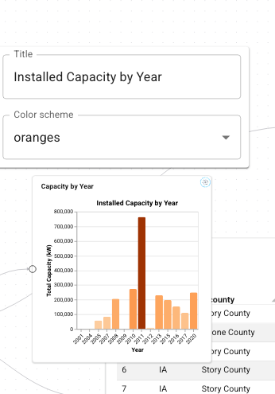

# Configure Nodes

Ports carry *runtime* values that flow between components. Configuration is
different: it is *design-time* state that the dashboard author sets on a node
while building the dashboard, not something wired from another component. Titles,
page sizes, display toggles, color schemes, and similar knobs are all
configuration.

Each node therefore has two pieces of state:

- **Node state** - one param per input/output port, updated by the dataflow
  engine as edges propagate values.
- **Config state** - one param per configuration field, edited through the node
  editor and saved with the dashboard.

This guide covers how to declare configuration, how it appears in the editor,
and how it reaches your component at instantiation time.

---

## Declaring configuration

There are three ways to declare configuration, all through `@register`.

### 1. Name Viewer params with `config`

For a `Viewer` component, the simplest option is to point at params that already
exist on the class and mark them as configuration rather than input ports. Any
name listed in `config` is removed from the component's input ports:

```python
import panel as pn
import param
from panel_flowdash import register

@register(component=True, title="Data Table", config=["title", "page_size"])
class app(pn.viewable.Viewer):
    filtered = param.DataFrame()          # stays an input port

    title = param.String(default="")      # becomes configuration
    page_size = param.Integer(default=10, bounds=(5, 100))

    def __panel__(self):
        ...
```

Here `filtered` remains a wired input, while `title` and `page_size` become
config fields. The param's `default`, `label`, and (for numeric/selector params)
bounds carry over to the generated editor.

### 2. Provide a config schema with `config_schema`

When configuration is unrelated to the component's own params, or the component
is a plain function, pass a `config_schema`. It accepts three forms:

**A `param.Parameterized` subclass** - every non-base param becomes a field:

```python
class TableConfig(param.Parameterized):
    title = param.String(default="")
    page_size = param.Integer(default=10, bounds=(5, 100))

@register(component=True, config_schema=TableConfig)
def app(config, instance_config):
    ...
```

**A JSON-Schema-like dict** - `properties` map to fields; an `enum` becomes a
selector, `default` and `title` are honored:

```python
schema = {
    "properties": {
        "mode": {
            "type": "string",
            "enum": ["compact", "comfortable"],
            "default": "compact",
            "title": "Density",
        }
    }
}

@register(component=True, config_schema=schema)
def app(config, instance_config):
    ...
```

**A Pydantic model** - its fields and defaults are read the same way as the dict
form.

### 3. Supply a custom editor with `config_editor`

By default FlowDash renders an auto-generated form from the config fields. To
take full control of the editing UI, pass a `config_editor` callable. It is
handed to the node editor and invoked with the current config data, the schema,
and callbacks:

```python
def editor(data, schema, *, id, type, on_patch):
    # build and return a custom editor view; call on_patch({...}) to apply changes
    ...

@register(component=True, config=["title"], config_editor=editor, ...)
class app(pn.viewable.Viewer):
    ...
```

---

## How configuration reaches your component

The way config is delivered depends on the component style.

**Viewer components.** Config-state params are synced onto the Viewer instance
when the node is created, and stay synced: editing a config field in the node
editor updates the corresponding param on the live instance. You do not need to
accept any extra argument, just declare the params and use them in
`__panel__`.

**Function components.** Declare an `instance_config` parameter to receive the
node's config-state object (a `param.Parameterized` instance). The existing
`config` argument still carries the shared session state, so the two are
distinct:

```python
@register(component=True, config_schema=TableConfig)
def app(config, instance_config):
    # instance_config.title, instance_config.page_size ...
    return pn.pane.Markdown(instance_config.param.title.rx())
```

`instance_config` is only injected when the function's signature includes it, so
existing components keep working unchanged.

---

## In the editor and on disk

Configuration fields declared via `config`/`config_schema` are attached to the
node type, so the node in the flow canvas shows an editable form (or your custom
`config_editor`) for them. Open it from the gear button on the node.



Edits are applied to the node's config state immediately and marked as unsaved.

When a dashboard is saved, each node's current configuration is written into its
stored item; on load it is overlaid back onto a fresh config-state object before
the component is instantiated, so nodes come back with the settings the author
chose. Unknown or rejected values are skipped with a warning rather than failing
the load.

---

## Related

- [Register components](register-components.md) - the full `@register` reference
- [Define ports](define-ports.md) - the runtime side of node state
- [Layout & sizing](layout-and-sizing.md) - controlling how tiles are placed
