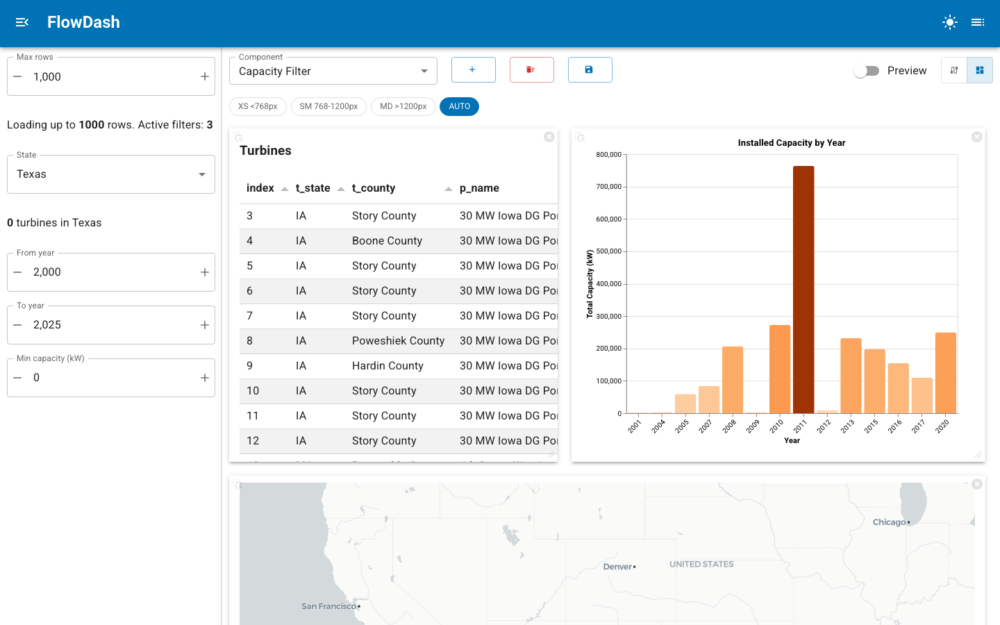

# Layout & Sizing

Once components are wired together, the editor has two views of the same set of
nodes:

- **Wiring mode** (`:material/cable:`) - the ReactFlow canvas where you add
  components and connect ports.
- **Dashboard mode** (`:material/dashboard:`) - a responsive tile grid that
  renders each component's live view, the layout your users actually see.

Toggle between them with the mode switch in the editor toolbar. In dashboard
mode a **Preview** switch turns the drag/resize handles off so you can see the
dashboard exactly as it will appear when served.



The breakpoint toolbar (XS / SM / MD / AUTO) and the **Preview** switch appear at
the top of dashboard mode; the sidebar filters on the left are the components
marked `sidebar=True`, described next.

---

## Sidebar components

Not every component belongs in the tile grid. Filters, data-source selectors,
and other controls often read better in a persistent sidebar. Mark such a
component with `sidebar=True`:

```python
@register(component=True, sidebar=True, title="Capacity Filter")
class app(pn.viewable.Viewer):
    min_capacity = param.Number(default=0, bounds=(0, 10000), step=100)

    @param.output(param.String)
    @param.depends("min_capacity")
    def filter_expr(self):
        return f"t_cap >= {self.min_capacity}" if self.min_capacity > 0 else ""

    def __panel__(self):
        return pmui.IntInput.from_param(self.param.min_capacity)
```

In dashboard mode, a `sidebar=True` component's view is rendered in the Page
sidebar instead of the tile grid, and the sidebar opens automatically whenever at
least one sidebar component is present. The component still participates in the
dataflow exactly like any other node, its ports wire up the same way; only its
placement changes.

The `complex_dataflow` example uses this for its data source and all three
filters, keeping the main grid for the table, chart, and map.

---

## Tile sizing hints

Components can declare their preferred size on the grid through `@register`:

```python
@register(
    component=True,
    default_size={"w": 6, "h": 4},
    min_size={"w": 3, "h": 2},
    max_size={"w": 12, "h": 8},
)
class app(pn.viewable.Viewer):
    ...
```

These are hints attached to the component spec. Widths are expressed in grid
columns and heights in grid rows. They give a sensible starting footprint for a
tile; the author can always resize tiles interactively in dashboard mode, and
the arrangement they settle on is what gets persisted.

---

## Responsive layouts

The tile grid is responsive. Its `breakpoints` are pixel-width thresholds that
divide the viewport into bands; the default is `[768, 1200]`, which yields three
bands (`sm` below 768px, `md` between, `lg` above 1200px). In edit mode a toolbar
lets you switch between these bands and arrange tiles independently for each one,
so a dashboard can stack into a single column on narrow screens while spreading
across the full width on a desktop.

Each band's arrangement is captured in `responsive_layouts`, a mapping from band
label to a list of tile entries. A single entry records a tile's index, width
(as a percentage of the row), height in pixels, and visibility:

```json
{
  "sm": [
    {"index": 0, "width": 98.7, "height": 837.0, "visible": true},
    {"index": 1, "width": 98.7, "height": 669.4, "visible": true}
  ],
  "lg": [
    {"index": 0, "width": 44.4, "height": 502.8, "visible": true},
    {"index": 1, "width": 54.7, "height": 502.8, "visible": true}
  ]
}
```

---

## What gets persisted

When you save a dashboard, the current grid arrangement and responsive settings
are stored alongside the nodes and edges:

- `tile_layout` - the arrangement for the current (default) band.
- `breakpoints` - the pixel thresholds in use.
- `responsive_layouts` - the per-band arrangements described above.

On load these are restored so the dashboard reopens with the same layout at every
breakpoint. See [Persist dashboards](persist-dashboards.md) for the storage model
and CRUD API.

---

## Related

- [Register components](register-components.md) - `sidebar`, `default_size`, `min_size`, `max_size`
- [Configure nodes](configure-nodes.md) - design-time configuration for each node
- [Persist dashboards](persist-dashboards.md) - how layouts are saved and loaded
