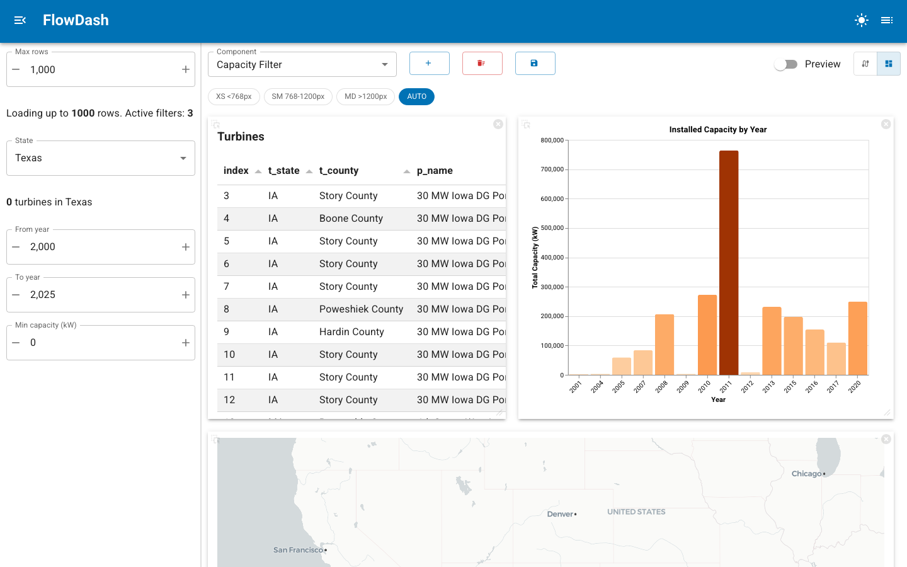

# Layout & Sizing

Once components are wired together, the editor has two views of the same set of
nodes:

- **Wiring mode** (`:material/cable:`) - the ReactFlow canvas where you add
  components and connect ports.
- **Dashboard mode** (`:material/dashboard:`) - a responsive tile grid that
  renders each component's live view, the layout your users actually see.

Toggle between them with the mode switch at the top of the editor's side panel. In dashboard
mode a **Preview** switch turns the drag/resize handles off so you can see the
dashboard exactly as it will appear when served.



The breakpoint toolbar (XS / SM / MD / AUTO) appears at the top of dashboard
mode and the **Preview** switch below the mode toggle; the sidebar filters on the left are the components
marked `sidebar=True`, described next.

---

## Sidebar components

Not every component belongs in the tile grid. Filters, data-source selectors,
and other controls often read better in a persistent sidebar. Mark such a
component with `sidebar=True`:

```python
@register(component=True, sidebar=True, title="Capacity Filter")
class app(pn.viewable.Viewer):
    min_capacity = param.Number(default=0, bounds=(0, 10000), step=100)

    @param.output(param.String)
    @param.depends("min_capacity")
    def filter_expr(self):
        return f"t_cap >= {self.min_capacity}" if self.min_capacity > 0 else ""

    def __panel__(self):
        return pmui.IntInput.from_param(self.param.min_capacity)
```

In dashboard mode, a `sidebar=True` component's view is rendered in the Page
sidebar instead of the tile grid, and the sidebar opens automatically whenever at
least one sidebar component is present. The component still participates in the
dataflow exactly like any other node, its ports wire up the same way; only its
placement changes.

The `complex_dataflow` example uses this for its data source and all three
filters, keeping the main grid for the table, chart, and map.

---

## Tile sizing hints

Components can declare their preferred size on the grid through `@register`:

```python
@register(
    component=True,
    default_size={"w": 6, "h": 4},
    min_size={"w": 3, "h": 2},
    max_size={"w": 12, "h": 8},
)
class app(pn.viewable.Viewer):
    ...
```

These are hints attached to the component spec. Widths are expressed in grid
columns and heights in grid rows. They give a sensible starting footprint for a
tile; the author can always resize tiles interactively in dashboard mode, and
the arrangement they settle on is what gets persisted.

---

## Responsive layouts

Arrange the tiles once, at the width you are working at, and the grid adapts the arrangement to narrower screens. The grid records the width you arranged the tiles at as `reference_width`. On a narrower screen each tile may shrink to half its authored width; once it would shrink further, it wraps onto a new line instead. Tiles in a row that no longer fits are split into evenly balanced lines, and a tile alone on a line takes the full width. In the `complex_dataflow` example the chart and map share a row on a desktop and stack above the table on a laptop with both side panels open.

The grid's `breakpoints` divide the viewport into bands; the default `[768, 1200]` yields `xs` below 768px, `sm` between, and `md` above 1200px. In edit mode a toolbar lets you preview each band:

- The band containing `reference_width` is marked **base**. Editing while it's shown changes the authored layout.
- Other bands show the generated layout. Editing one saves a custom layout for that band, marked **custom**, and **Reset** discards it again.
- **AUTO** returns to the natural width.

Custom layouts are stored in `responsive_layouts`, a mapping from band label to a list of tile entries. Each entry records a tile's index, width (as a percentage of the row), height in pixels, and visibility:

```json
{
  "xs": [
    {"index": 0, "width": 100, "height": 440, "visible": true},
    {"index": 1, "width": 100, "height": 450, "visible": true}
  ]
}
```

---

## What gets persisted

When you save a dashboard, the grid arrangement and responsive settings are stored alongside the nodes and edges:

- `tile_layout` - the authored arrangement.
- `reference_width` - the grid width in pixels the arrangement was authored at.
- `breakpoints` - the pixel thresholds in use.
- `responsive_layouts` - the custom per-band arrangements described above.

On load these are restored so the dashboard reopens with the same layout at every width. Dashboards saved before `reference_width` existed are treated as authored at the largest breakpoint. See [Persist dashboards](persist-dashboards.md) for the storage model and CRUD API.

---

## Related

- [Register components](register-components.md) - `sidebar`, `default_size`, `min_size`, `max_size`
- [Configure nodes](configure-nodes.md) - design-time configuration for each node
- [Persist dashboards](persist-dashboards.md) - how layouts are saved and loaded
