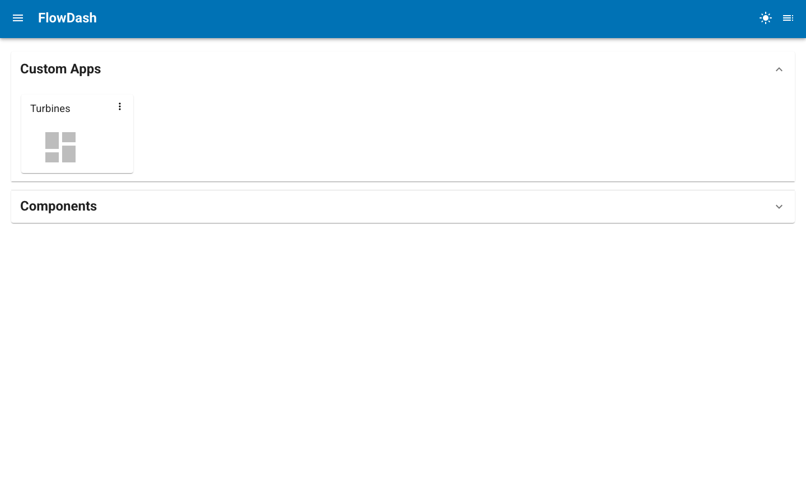

# Serve a Project

The `flowdash serve` command scans a project directory, discovers components
and pages, and launches a Panel server with all routes configured.

---

## Basic usage

```bash
flowdash serve my_project/
```

This:

1. Adds `my_project/` to `sys.path`
2. Scans subdirectories for modules with `@register`-decorated `app` exports
3. Builds the component registry and specs
4. Creates a `DashboardStore` at `my_project/dashboards.db`
5. Serves the app on `http://0.0.0.0:5006`

The landing page lists the project's pages and any saved dashboards. From here
you can open a dashboard, or jump into the editor to build a new one.



---

## CLI options

```bash
flowdash serve <directory> [options]
```

| Option | Default | Description |
|--------|---------|-------------|
| `--port` | `5006` | Port to serve on. |
| `--address` | `0.0.0.0` | Address to bind to. |
| `--title` | `FlowDash` | Application title in the browser tab. |
| `--home-dashboard` | none | Dashboard (id or title) to show on the homepage instead of the grid. |
| `--db-path` | `<dir>/dashboards.db` | Path to the SQLite database. |
| `--warm` | off | Import all modules at startup instead of lazily on first visit. |
| `--dev` | off | Enable autoreload for development. |
| `--admin` | off | Enable the Panel admin interface. |
| `--profiler` | none | Profiler to use (pyinstrument, snakeviz). |
| `--num-threads` | auto | Thread pool size. |
| `--allow-websocket-origin` | all | Restrict allowed websocket origins. |
| `--no-notifications` | off | Disable Panel notifications. |
| `--static-dirs` | none | Serve extra static file directories, e.g. `--static-dirs assets=/path/to/assets`. Paths are resolved relative to the project directory. |
| `--plugins` | none | Register extra Tornado routes from an importable module exposing a `ROUTES` list, e.g. `--plugins my_plugin` for `<project>/my_plugin.py`. Repeatable. |

`flowdash serve` is built on Panel's `serve` command and inherits its full
set of CLI options (OAuth, REST providers, session options, and more).
Run `flowdash serve --help` for the complete, up-to-date list.

---

## Development mode

```bash
flowdash serve my_project/ --dev --port 8080
```

With `--dev`, the server reloads automatically when source files change.

---

## Custom database location

By default, the dashboard database is created inside the project directory.
Override this for shared deployments:

```bash
flowdash serve my_project/ --db-path /var/data/flowdash.db
```

---

## Homepage dashboard

By default the homepage (`/`) shows the launcher grid listing the project's
pages and saved dashboards. To land users directly on a specific dashboard
instead, pass `--home-dashboard` with either its id or its title:

```bash
flowdash serve my_project/ --home-dashboard "Sales Overview"
```

The dashboard is resolved by id first, then by title. If it cannot be found, or
the current user is not authorized to view it, the homepage falls back to the
launcher grid. The grid remains reachable through the "Home" entry only when no
home dashboard is configured, so use this for deployments centered on a single
dashboard.

---

## Running as a module

You can also run FlowDash without the entry point script:

```bash
python -m panel_flowdash.command serve my_project/
```

---

## Lazy loading and warm start

By default, page and component modules are imported lazily — on the first visit
to that page or on first open of the component editor. This keeps startup fast
even when individual modules have heavy dependencies.

Pass `--warm` to import all modules at startup instead:

```bash
flowdash serve my_project/ --warm
```

Import errors are logged as warnings; they do not abort startup.

---

## Project initialization file

If `my_project/__init__.py` exists, it is executed during server startup —
before registry scanning and before Panel launches. Use it for any
pre-configuration that the rest of the project depends on:

```python
# my_project/__init__.py
import os
import panel as pn

os.environ.setdefault("DATABASE_URL", "postgresql://localhost/mydb")

# Register Panel extensions needed by your components (e.g. tabulator, vega, deckgl).
# FlowDash only calls pn.extension() with notifications enabled by default,
# so any additional extensions must be loaded here.
pn.extension("tabulator", "vega", sizing_mode="stretch_width")
```

The file runs with `my_project/` already on `sys.path` and as the working
directory, so local relative imports work normally.

---

## Page-aware sidebar and contextbar

`FlowDashApp` exposes two `sidebar` and `contextbar` parameters whose contents
are prepended to the app's own sidebar and navigation contextbar. To populate
them differently depending on which page is being served, define a
`configure_layout` function in the project `__init__.py`:

```python
# my_project/__init__.py
import panel_material_ui as pmui


def configure_layout(app, content, route):
    """Set sidebar/contextbar contents for the page currently being served.

    Called on every navigation with:
      app     - the FlowDashApp instance (set app.sidebar / app.contextbar)
      content - the resolved view for this route (page, editor, or launcher)
      route   - the current pathname, e.g. "/", "/components", "/dash/<id>"
    """
    if route.startswith("/dash/"):
        app.sidebar = [pmui.Typography("Dashboard tools", variant="overline")]
        app.contextbar = []
    else:
        app.sidebar = []
        app.contextbar = []
```

FlowDash looks the function up by name after executing `__init__.py`, so the
name must be exactly `configure_layout`. It runs once per navigation, just
before the main area is rendered, and is responsible for both slots: whatever
you assign to `app.sidebar` / `app.contextbar` replaces the previous page's
contribution, so clear a slot by assigning `[]`. Exceptions raised by the hook
are logged and do not break navigation.

The `route` argument distinguishes the built-in routes (`/` for the launcher,
`/components` for the editor, `/dash/<id>` for a saved dashboard) from page
routes (`/<Section>/<name>`). Use `content` when the sidebar needs to reach into
the rendered view itself.

---

## Project structure requirements

```
my_project/
    __init__.py             # optional startup hook (runs before server launch)
    SectionA/
        __init__.py         # optional
        component1.py       # must export `app`
        component2.py
    SectionB/
        page1.py
    .hidden/                # ignored (starts with .)
    _private/               # ignored (starts with _)
```

Each Python file must export an `app` attribute decorated with `@register`.
Files starting with `_` are skipped. Directories starting with `.` or `_` are
skipped.
